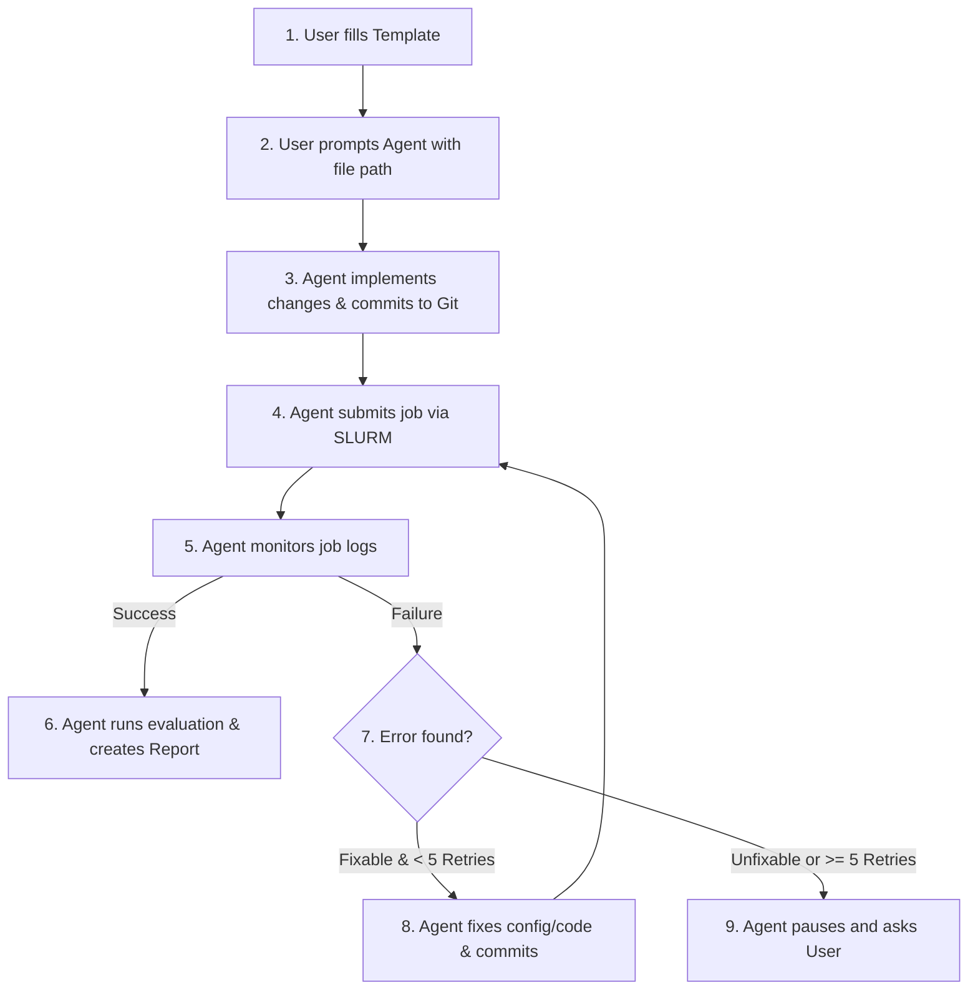

# Experiment Workflow & Plan Template

This file defines the standard process for planning and running experiments.
Read it before creating a new experiment. The plan template is in §3 — copy it
into a new folder and fill it in.

---

## 1. Workflow



---

## 2. How to Run an Experiment

1. Create a new folder: `experiments/EXP-XXX/`
2. Copy the template below into it as `plan.md`
3. Fill in all sections
4. Prompt the agent with `/goal`:

> `/goal Please run the experiment defined in experiments/EXP-XXX/plan.md. Implement the changes, commit, submit to SLURM, monitor, debug if needed, and write the final report.`

---

## 3. Experiment Plan Template

> **Copy everything below the line into `experiments/EXP-XXX/plan.md` and fill it in.**

---

### Overview
- **Experiment ID:** `EXP-XXX`
- **Title:** [Brief descriptive title]
- **Objective / Hypothesis:** [What research question are we answering?]

### Code Implementation & Setup
- **Target Files:** [Which files need modification? e.g. `mmdet3d/datasets/pipelines/transforms_3d.py`]
- **Changes Required:**
  - [ ] Detail 1: ...
  - [ ] Detail 2: ...

  Note: the agent may modify files outside this list if necessary to make the
  experiment run, but every modification must be documented in the report.

### Configuration & SLURM Resources
- **Target Server:** [PLEIADES — smoke tests only | CLAIX — full training]
- **Base Config:** [e.g. `projects/adv_aug/configs/pointpillars/hv_pointpillars_fpn_sbn-all_4x8_2x_nus-3d.py`]
- **Config Overrides:** [List any hyperparameter changes]
- **SLURM Partition:** [PLEIADES: `gpu` | CLAIX: `c23g`]
- **SLURM Account:** [PLEIADES: `etechnik_gpu` | CLAIX: default]
- **GPU Count:** [Default: 1 for smoke, 8 for full]
- **CPUs per Task:** [Default: 4]
- **Time Limit:** [e.g. `00:30:00` for smoke, `24:00:00` for full]

### Execution Commands
```bash
# Training
sbatch projects/adv_aug/scripts/submit/run_experiment.sbatch train <model>

# Evaluation
./tools/slurm_test.sh <PARTITION> <JOB_NAME> <CONFIG> <CHECKPOINT> --eval bbox
```

### Evaluation Settings
- **Checkpoint to evaluate:** [path]
- **Metrics to report:** [e.g. mAP, NDS, per-class AP]

---

## 4. Guardrails

### Codebase Edits
- The agent may edit any file necessary to complete the experiment or resolve bugs.
- **Every modified file must be listed with a diff and explanation in the final report.**

### Cluster Policy
- **PLEIADES** (5× A100, low queue) — framework verification, smoke tests, debugging only.
- **CLAIX** (10+ H100, ~1–2 day queue) — full-scale training only, after PLEIADES verification.
- No hardcoded job limits — defer to the SLURM scheduler for queue and runtime management.

### SLURM Job Acceptance Check
After submitting a job, verify it was accepted by checking `squeue --me`:
- **`RUNNING` or `PENDING`** — fine. `PENDING` just means waiting for resources; do not intervene.
- **Not appearing in the queue / immediately disappearing** — the job was rejected or crashed on startup. This means there is a problem with the script (bad path, missing module, syntax error, etc.). Inspect the `.out`/`.err` output, fix the script, and resubmit. This counts as one retry toward the 5-retry limit.

### Auto-Debugging (≤ 5 Retries)
If a job fails:
1. Inspect logs in `work_dirs/` or `projects/adv_aug/runs/`.
2. Identify the cause (OOM → lower batch size, Python error → fix source, SLURM failure → resubmit).
3. Commit the fix with prefix `[debug-EXP-XXX]`.
4. Resubmit and retry — **up to 5 times**.
5. If still failing after 5 retries, **stop and ask the user**.

### Generated Artifact Storage
All generated artifacts for an experiment must be stored inside that same
experiment folder. Do not leave primary outputs scattered under `work_dirs/` or
`projects/adv_aug/runs/` unless a tool requires a temporary working directory;
if that happens, copy or move the final artifacts back into
`experiments/EXP-XXX/`.

Recommended layout:
- SLURM stdout/stderr and training/eval logs: `experiments/EXP-XXX/assets/logs/`
- TensorBoard/event logs: `experiments/EXP-XXX/assets/tensorboard/`
- Plots, charts, and visualizations: `experiments/EXP-XXX/assets/plots/`
- Evaluation outputs such as `.pkl` or JSON files: `experiments/EXP-XXX/assets/eval/`
- Trained checkpoints and model weights: `experiments/EXP-XXX/weights/`

---

## 5. Report Requirements

Each completed experiment must produce a report at `experiments/EXP-XXX/report.md`.

### File Locations
| Artifact | Path |
|----------|------|
| Plan | `experiments/EXP-XXX/plan.md` |
| SLURM scripts | `experiments/EXP-XXX/*.sbatch` |
| Report | `experiments/EXP-XXX/report.md` |
| SLURM / training / eval logs | `experiments/EXP-XXX/assets/logs/` |
| TensorBoard logs | `experiments/EXP-XXX/assets/tensorboard/` |
| Plots / visualizations | `experiments/EXP-XXX/assets/plots/` |
| Evaluation outputs | `experiments/EXP-XXX/assets/eval/` |
| Checkpoints / weights | `experiments/EXP-XXX/weights/` |

### Required Report Contents
- Experiment ID & title
- Git commit hash of the implementation
- List of all modified files with diffs and explanations
- Config overrides relative to the base config
- Training logs & visualizations (loss curves, learning rate)
- Evaluation metrics table (mAP, NDS, per-class where relevant)
- Conclusion and recommended next steps
