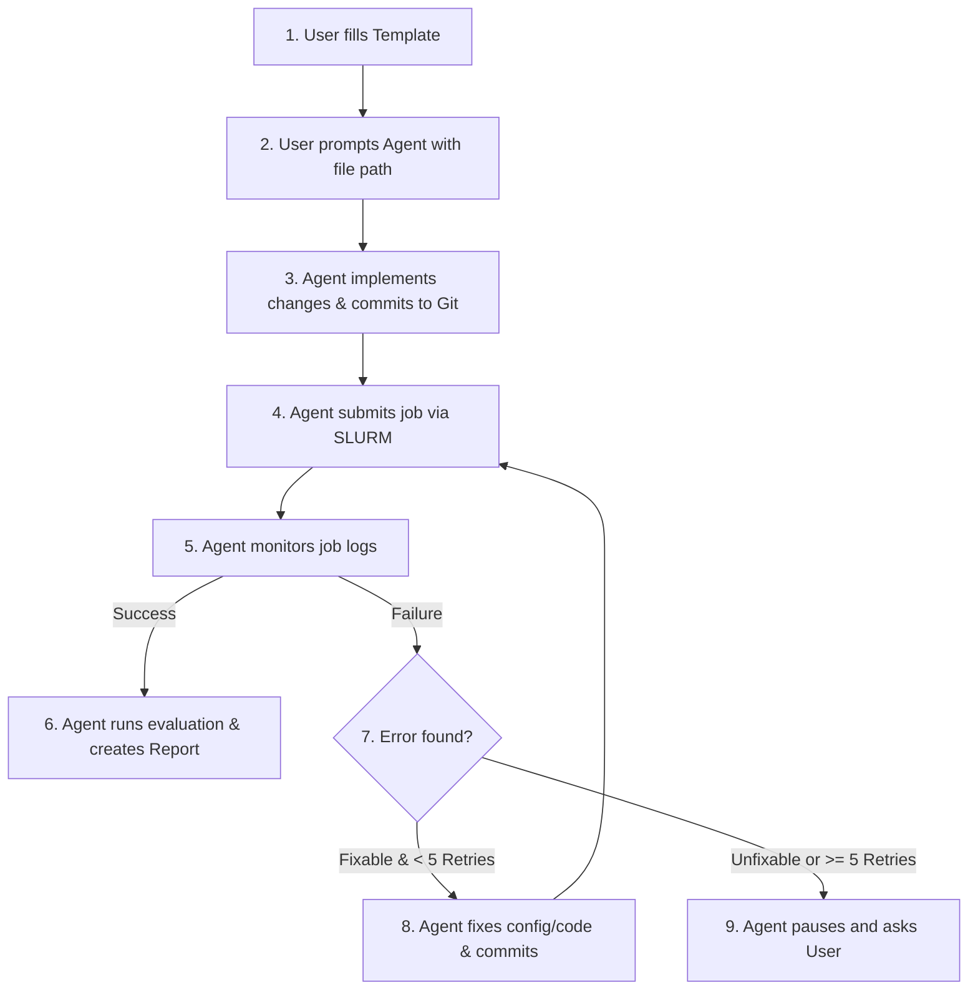

# Research Experiment Guide & Workflow

This document outlines the standard operating procedure for assigning research experiments to the AI assistant. 

A template has been created at [experiments/template.md](file:///home/btq48260/DAAD_2026_adversarial_augmentation/experiments/template.md).

---

## Workflow Diagram

---

## How to Trigger an Experiment

1. **Copy the template:** Save the copy as `experiments/experiment_N.md`.
2. **Fill out the details:** Describe the implementation, SLURM configuration, and metrics to track.
3. **Trigger using `/goal`:** Start your prompt with `/goal` to ensure the agent executes the job thoroughly in the background and runs until completion.

### Example Prompt
> /goal Please run the experiment defined in [experiments/experiment_1.md](file:///home/btq48260/DAAD_2026_adversarial_augmentation/experiments/experiment_1.md). Ensure the implementation is committed, monitor the SLURM queue, debug if needed, and draft the final report.

---

## Guardrails & Execution Guidelines

### 1. Codebase Edits & File Guardrails
* The agent is allowed to edit codebase files as necessary to implement the experiment or resolve bugs.
* **Important:** Every single file modified must be documented, explained, and listed with code diffs in the final report.

### 2. SLURM Resource & Queue Management
* The agent submits jobs using the SLURM cluster command scripts (e.g., `tools/slurm_train.sh` or `tools/slurm_test.sh`).
* The agent does not enforce hard limits on active jobs or running times; it will defer scheduling and queue management to the cluster's SLURM policies.

### 3. Auto-Debugging Protocol (Up to 5 Retries)
If a SLURM job fails:
* The agent will inspect logs (stdout/stderr or files under `work_dirs/`).
* The agent will attempt to resolve the issue (e.g., scale down batch size for OOM, modify source files for python errors, or adjust hyperparameters).
* The agent will commit debug fixes with the prefix `[debug-EXP-XXX]`.
* **The agent will retry up to 5 times** before pausing and asking the user for assistance.

---

## Report Requirements & Storage

After an experiment completes successfully, the agent will compile a detailed report.

### 1. Report Location
* **Workspace:** Saved to `experiments/reports/EXP-XXX.md` (where `EXP-XXX` is the Experiment ID).
* **Assets:** Any loss curve plots, learning rate charts, or validation log snippets must be saved in `experiments/reports/assets/`.
* **Agent Chat Artifact:** The agent will mirror the report as a chat artifact for easy inspection in the interface.

### 2. Report Contents
Each report must contain:
- **Experiment ID & Title**
- **Git Commit Hash** of the final code implementation.
- **Modified Files:** A list of all modified files with clear explanations and git diffs.
- **Config Overrides:** Any hyperparameters modified relative to the base configuration.
- **Training Logs & Curves:** Visualizations/plots showing training loss and learning rate over time.
- **Evaluation Metrics:** Detailed table containing key metrics (e.g., mAP, NDS) compared with baseline models or previous experiments.
- **Conclusion & Recommendations:** A brief analysis of the results and proposed next steps.
